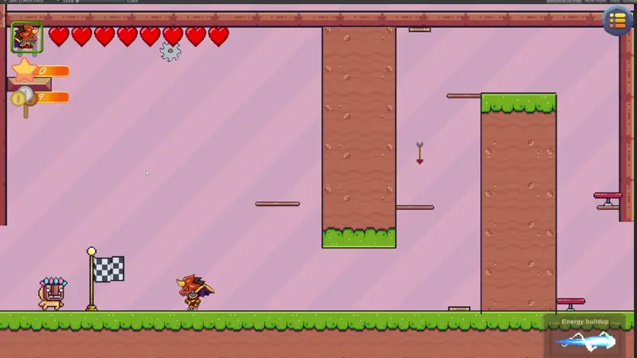
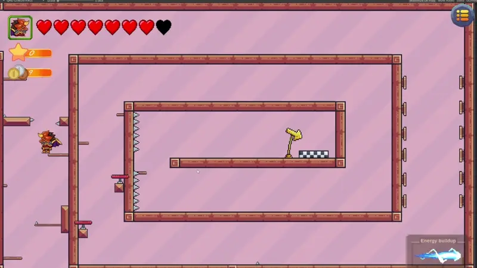

# Dragon Warrior Adventure: Project Documentation

This document details the development and features of "Dragon Warrior Adventure," a 2D pixel art platformer project developed in Unity 2020 in 2022. This project served as a practical exercise to implement various core game mechanics, UI elements, level design concepts, and asset integration within the Unity engine.

## 1. Project Overview

"Dragon Warrior Adventure" is a 2D platformer prototype focusing on demonstrating fundamental game development concepts. The project features a playable character capable of standard platforming movements and combat abilities, navigating through a series of distinct levels with varying challenges. Key implementations include character control, enemy AI (basic patrol/aggro), environmental hazards, collectible systems (coins, points, health), a simple shop/upgrade system, UI management (health, currency, score, energy, timers, boss health bars), checkpoint functionality, differing level structures (including timed challenges and a boss encounter), and integration of external pixel art assets. Developed in 2022 using Unity 2020, the project reflects the programming skills and learning progress at the time of its creation.

## 2. How to Access and Run

The playable build of the project can be downloaded from the following Google Drive link:

*   **Download Link:** [https://drive.google.com/drive/folders/1wm9INpzLT8uFH7WI6aDEInA9xXau5JUI?usp=drive_link](https://drive.google.com/drive/folders/1wm9INpzLT8uFH7WI6aDEInA9xXau5JUI?usp=drive_link)

**Running the Game:**

1.  Download the folder from the link above.
2.  Extract the contents to a local folder.
3.  Before launching `hra.exe`, it is recommended to lower your system's volume, as the initial in-game volume is high.
4.  Launch `hra.exe`.
5.  After the game starts, press the `ESC` key to open the pause menu.
6.  Click the "Restart" button. This step resolves a known issue that appeared after the project was reopened. You can then adjust the volume using the in-game settings if needed.

## 3. Implemented Features

*   **Character Controller:** Implementation of a 2D character controller supporting horizontal movement, jumping, and dashing. Multi-jump functionality is also implemented as an unlockable ability.
*   **Combat System:** Basic melee combat system including standard attacks and a charged attack mechanic. An area-of-effect skill ('Explosion') is also implemented as an unlockable ability.
*   **Enemy AI:** Basic enemy behaviors including patrolling and reaction to player proximity (combat engagement).
*   **Hazard Implementation:** Integration of various environmental hazards (spikes, sawblades, projectiles) with collision detection and player health interaction.
*   **Collectible System:** Implementation of systems for collecting coins (currency), hearts (health restoration), and stars (score/points).
*   **Shop & Progression System:** Functioning shop interface allowing players to spend collected currency on permanent character upgrades (max health, health regen, attack speed, multi-jump, explosion skill).
*   **UI System:** Comprehensive UI implementation including:
    *   Player Health Display (Heart icons)
    *   Currency Counter (Coins)
    *   Score Counter (Stars)
    *   Boss Health Bar
    *   In-game Timer for specific challenges
    *   Shop Interface
    *   Basic Main Menu with settings (Audio, Resolution placeholders)
*   **Level Management:** Design and implementation of multiple distinct levels/rooms, each with unique layouts, themes, and challenge types.
*   **Timed Challenges:** Specific levels designed with a timer and conditions (e.g., defeat all enemies before time expires).
*   **Boss Implementation:** A dedicated boss enemy with its own health pool and simple attack patterns, requiring a specific combat encounter.
*   **Checkpoint System:** Implementation of checkpoints to save player progress within levels.
*   **Asset Integration:** Effective integration and utilization of external pixel art asset packs for characters, environments, hazards, and UI elements.

## 4. Gameplay Mechanics Details

*   **Movement:** Player controlled via horizontal axis (`A`/`D`), jump (`Space`), and dash (`Q`). Multi-jump state managed after upgrade purchase.
*   **Combat:** `Mouse 1` triggers a standard attack animation and damage event. Holding `E` charges a more powerful attack. `R` triggers the Explosion skill if unlocked and energy is available.
*   **Collectibles:** Trigger collision events adding value to respective UI counters. Hearts also trigger health restoration.
*   **Shop:** Interaction with a shop trigger presents a UI panel. Buttons within the UI trigger coin expenditure and apply permanent stat/ability changes to the player character.
*   **Challenges:** Level design combines platforming sequences with areas requiring enemy engagement. Timed challenges utilize a countdown timer, penalizing the player (e.g., death) if the condition is not met.

## 5. Character & Entity Implementation

*   **Player Character (Dragon Warrior):** Implemented with a state machine or equivalent logic for movement, combat, animation transitions, and interactions with collectibles and hazards. Sprite sourced from the "Dragon Warrior" asset pack.
*   **Standard Enemy (Knight):** Implemented with basic movement logic (patrolling) and simple attack behavior upon player detection. Collision with hazards or player attacks triggers damage/death states. Sprites sourced from the "Knight Sprite Sheet" and potentially "Pixel Adventure 1".
*   **Boss Enemy (Crimson Knight):** Implemented with a distinct state machine, larger health pool, specific attack patterns, and interaction with the dedicated boss health UI bar.
*   **Hazards:** Static or moving objects with colliders triggering damage on the player upon contact. Examples include spike hitboxes, rotating sawblade colliders, and projectile scripts. Assets primarily from "Pixel Adventure 1."

## 6. Level Design Approach

Levels were designed as individual scenes or distinct areas within a larger scene, allowing for varied environmental themes and obstacle arrangements. The approach involved:
*   Implementing various platforming types (static, moving).
*   Placing environmental hazards requiring precise movement.
*   Designing combat arenas with specific enemy placements.
*   Integrating timed challenge mechanics into certain layouts.
*   Creating dedicated spaces for shop access and boss encounters.
*   Utilizing background and platform tilemaps from asset packs to create distinct visual identities for each area.

## 7. UI Element Integration

UI elements were implemented using Unity's UGUI system. Data from game managers (player health, currency, score, timer, boss health) is linked to UI text fields, image fills, and icons, updating dynamically during gameplay. Button functionality in the shop and menu triggers corresponding game logic (upgrades, settings changes).

## 8. Development Environment & Learnings

*   **Engine:** Unity 2020.3.11f1
*   **IDE:** Visual Studio 2022
*   **Development Period:** 2022
*   **Key Learnings Demonstrated:**
    *   Fundamentals of 2D physics and character control in Unity.
    *   Implementing different types of enemies and hazards.
    *   Working with basic 2D animations.
    *   Designing and managing multiple distinct game levels.
    *   Developing UI systems for displaying game state and enabling player interaction (shop, menu).
    *   Integrating and working with third-party assets.
    *   Implementing core game loops (collecting, spending, combat, progression).
    *   Handling time-based game mechanics.

## 9. Controls

*   **Movement:** `[A, D]`
*   **Jump:** `Space`
*   **Dash:** `[Q]`
*   **Basic Attack:** `Mouse1`
*   **Charged Attack:** `[E]`
*   **Explosion Skill:** `[R]` (Unlocks via Shop)

## 10. Used Assets

The following assets from the Unity Asset Store were utilized in this project:

*   **Knight Sprite Sheet (Free):**
    *   Link: https://assetstore.unity.com/packages/2d/characters/knight-sprite-sheet-free-93897
*   **Pixel Adventure 1:**
    *   Link: https://assetstore.unity.com/packages/2d/characters/pixel-adventure-1-155360
*   **Warped Shooting FX:**
    *   Link: https://assetstore.unity.com/packages/2d/textures-materials/abstract/warped-shooting-fx-195246
*   **Dragon Warrior (Free):**
    *   Link: https://assetstore.unity.com/packages/2d/characters/dragon-warrior-free-93896

## 11. Screenshots

Visual documentation of different stages and aspects of the project, referencing specific level types or features. The images are expected to be located relative to this document (e.g., in a 'ReadmeImages' subdirectory).

*   **Starting screen:**
    

*   **Second room:**
    

*   **Shop:**
    

*   **Crazy chaotical room:**
    

*   **Following cube room:**
    

*   **Timed room:**
    

*   **Boss Phase 1:**
    

*   **Boss Phase 2:**
    

---